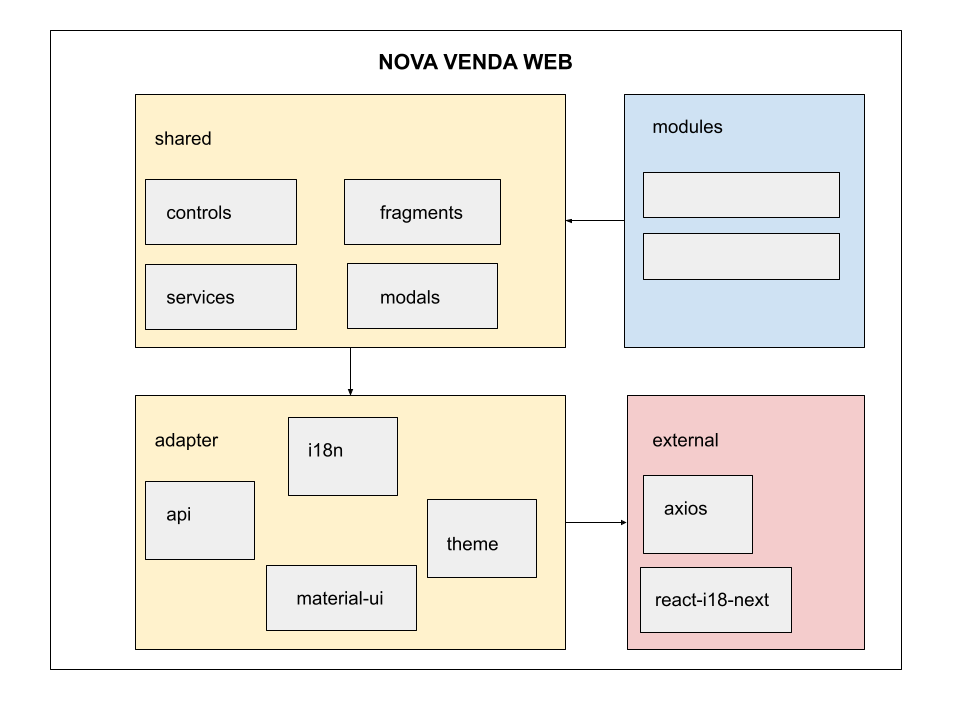

# Nova Venda WEB
## Documentação

[](https://nodesource.com/products/nsolid)


Nova versão da Venda Web totalmente reformulada usando React consumindo os serviços da RJ Api.

# Tecnologias utilizadas

- Nodejs
  - v14.17.0
- React
  - 17.0.2


## Orientações arquiteturais

## Gerais
- Procure não reinventar a roda. Sempre verifique se já existe alguma coisa implementada para o que você precisa. 
- Se for adicionar alguma biblioteca ao projeto, certificar que seja uma lib com projeto com atualizações constantes e recentes e com comunidade ativa.

### Estrutura 
- Estrutura de pastas segue orientação semantica, refletindo as funcionalidade e componentes. 
- Todos os componentes especificos de um funcionalidade, devem ficar como subpastas na pasta da funcionalidade
- Componentes que são comuns a 2+ funcionalidades ou componentes devem ficar na pasta 'shared'
- Atentar para tentar não criar mais do que 2-3 niveis de pastas

### Componentes
- Devem ser customizáveis/extensiveis
- Devem ser testáveis via jest
- Devem ser criados como funções javascript
- Devem começar com letra maiuscula conforme convenção da doc do React
- Tudo referente a um componente(arquivos js,css,imagens etc) deve ficar dentro da pasta do componente
- Não devem depender diretamente da implementação da camada de comunicação com backend
- Cada componente deve estar separado em seu proprio arquivo .js

#### Controle de estado e comunicação entre componentes
- Não abuse do uso do estado global da aplicação. Somente  
- Faça a separação de contextos de acordo com a necessidade de comunicação das funcionalidades e componentes.
	Se determinadas informações diz
- Algumas refs: 
	- [How to use React Context effectively](https://kentcdodds.com/blog/how-to-use-react-context-effectively)
	- [Application State Management with React](https://kentcdodds.com/blog/application-state-management-with-react)
	- [Split contexts that don't change together](https://github.com/facebook/react/issues/15156#issuecomment-474590693)

### Estilização
- Evitar ao maximo de usar inline style.
- Não incluir textos e labels diretamente no html do componente, incluir somente via arquivos de messages(i18n)
- **Design de referencia: https://www.figma.com/file/08jpMjvDSLkRPwWY2kvoNJ/VENDA-WEB?node-id=0%3A1**

### Comunicação com backend
- Comunicação com backend fica em camada independente
- Componentes não devem depender diretamente da implementação da camada de comunicação
- Consumir os serviços da RJ Api
- Cada serviço da RJ Api deve ter um componente cliente separado em arquivo .js proprio com sufixo ApiService. 
	Ex.: BuscarTrechosApiService.js
- Os componentes devem chamar os metodos do **ApiServicesProxy.js**, que abstrai a parte do backend do resto da aplicação.

### Stack
#### Front-end
  - React
	- **Gerenciador de pacotes: [Yarn](https://yarnpkg.com/)**
	- Controle de estado da aplicação: Hooks com [Context API](https://reactjs.org/docs/context.html) 
	- Internacionalização: [React-i18next](https://react.i18next.com/)
	- Roteamento: [React-router](https://reactrouter.com/)
	- Comunicação com backend/api: [Axios](https://github.com/axios/axios)
	- estilização: [Material-UI/Emotion](https://mui.com/pt/getting-started/usage/)
	- Teste/QA: [Jest](https://jestjs.io/pt-BR/docs/tutorial-react)
	
#### Backend
  - [RJ Api](http://api.rjconsultores.com.br/api-gateway/servicos)
  - [Repositorio](http://18.235.188.113:3000/rj-api/api)
  - Dados para acesso:
  	- Autenticação: 
	  	usuario:apiweb
		senha:web102030
	- [Documentação](http://api.rjconsultores.com.br/api-gateway/swagger/swagger-ui.html#/)
		usuário: swagger
		senha: rjswaggerapi

#### Ambiente Dev
  - [VSCode](https://code.visualstudio.com/)
  - [React Developer Tools](https://chrome.google.com/webstore/detail/react-developer-tools/fmkadmapgofadopljbjfkapdkoienihi?hl=en)
		- https://pt-br.reactjs.org/blog/2019/08/15/new-react-devtools.html
    
## Arquitetura do projeto

O projeto foi pensado isolando a camada de domínio das camadas de implementação.




## `modules`

Armazena o domínio do sistema, ou seja, as telas completas que atendem às funcionalidades.

## `shared`

Camada composta de componentes reutilizáveis no projeto. Possui pequenos componentes, chamados de `controls`, pedaços de código reutilizáveis chamados de `fragments`, serviços compartilhados de acesso a API chamado de `services` e telas estilo modal.

### `controls`

Armazena os menores componentes usados nas telas. 
Os componentes serão criados com prefixo RJ para não confundir com os componenentes do React.
Ex.: RJSelect, RJTextField, etc.

### `services`

### `fragments`

Pedaços de código que podem ser utilizados em diversas partes do aplicativo.
Exemplo: CABECALHO e RODAPE

## Style Guide

O padrão de codificação será dividido em padrão para o React, CSS e JavaScript.

### React

O padrão adotado será o mesmo do AirBnb: [Airbnb React/JSX Style Guide](https://airbnb.io/javascript/react/).

A versão em português pode ser lida em:  [Airbnb React/JSX Style Guide em Portugês](https://github.com/ronal2do/airbnb-react-styleguide).

Especial atenção para os seguintes tópicos:

- Nomenclatura
  - Extensão: Use a extensão .jsx para componentes React.
  - Nome do arquivo: Use PascalCase para os arquivos. Ex.: MeuComponente.jsx.
  - Referência de nomenclatura: Use PascalCase para componentes e camelCase para as instâncias. 
- Indentação

```sh
// ruim
<Componente primeiroParametro="bar"
            maisUmParametro="baz" />

// ideal
<Componente
  primeiroParametro="bar"
  maisUmParametro="baz"
/>

// Se for apenas um parâmetro coloque na mesma linha.
<Componente bar="bar" />

// children recebe indentação normal.
<Componente
  primeiroParametro="bar"
  maisUmParametro="baz"
>
  <ComponenteFilho />
</Componente>
```

- Aspas
  - Sempre usa aspas duplas (") para atributos, mas aspas simples para todos os outros JS usados no componente.
```sh
// ruim
<Componente bar='bar' />

// ideal
<Componente bar="bar" />

// ruim
<Componente style={{ left: "20px" }} />

// ideal
<Componente style={{ left: '20px' }} />
```


- Espaçamento
```sh
// ruim
<Foo/>

// tá de sacanagem néh?
<Foo                 />

// ruim
<Foo
 />

// ideal
<Foo />
```
  - Não precisa usar espaço dentro nas chaves de parâmetros de um componente.
```sh
// ruim
<Foo bar={ baz } />

// ideal
<Foo bar={baz} />
```

- Props
  - Sempre use camelCase para prop names.
```sh
// ruim
<Componente
  UserName="hello"
  phone_number={12345678}
/>

// ideal
<Componente
  userName="hello"
  phoneNumber={12345678}
/>
```

  - Quando o valor Booleano for true pode ser omitido.

```sh
// ruim
<Component
  hidden={true}
/>

// ideal
<Component
  hidden
/>
```
  - Sempre inclua o parâmetro alt em suas  tags. E alt pode ser uma string vazia em .
```sh
// ruim


// ideal


// ideal

```

- Não use palavras como "image", "photo", ou "picture" no alt de sua .
Screenreaders já interpretam img como um elemento de imagem, por isso não há necessidade de incluir esta informação no texto do alt.

```sh
// ruim


// ideal

```
  - Evite usar index como key de props, opte por um ID
  
  ```sh
  {todos.map((todo, index) =>
  <Todo
    {...todo}
    key={index}
  />
)}

// ideal
{todos.map(todo => (
  <Todo
    {...todo}
    key={todo.id}
  />
))}
  ```
- Parenteses

  - Coloque Tags JSX entre parênteses quando eles abrangem mais de uma linha
  
```sh
// ruim
render() {
  return <Componente className="long body" foo="bar">
           <ComponenteFilho />
         </Componente>;
}

// ideal
render() {
  return (
    <Componente className="long body" foo="bar">
      <ComponenteFilho />
    </Componente>
  );
}

// ideal, para uma linha.
render() {
  const body = <div>hello</div>;
  return <Componente>{body}</Componente>;
}
```
- Tags
  - Sempre que a Tag não possuir children use self-close ( ).
```sh
// ruim
<Foo className="stuff"></Foo>

// ideal
<Foo className="stuff" />
```


